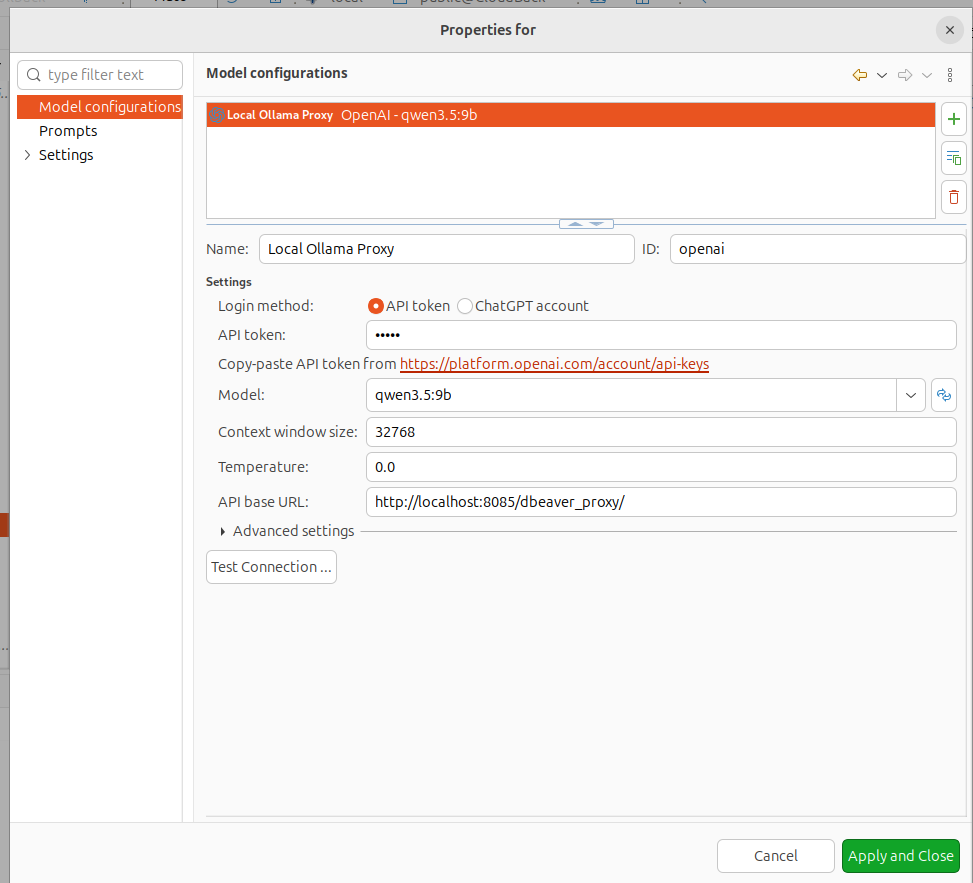

# DBeaver Ollama Proxy

[](https://opensource.org/licenses/MIT)
[](https://openjdk.org/)
[](https://spring.io/projects/spring-boot)
[](https://www.docker.com/)

> A Spring Boot proxy that lets **DBeaver AI Chat** talk to a **local Ollama model** instead of OpenAI.
> No cloud. No data leaks. Full control over your database schema.

---

## 🎯 The Problem

DBeaver 26+ ships with a built-in AI assistant that, by default, sends your **database metadata** (table names, columns, schemas) to **OpenAI's cloud API**.

For many teams — especially those working with sensitive data — this is **unacceptable**:

- Your **schema goes to a third party**.
- You **can't control** what happens to it.

## 💡 The Solution

This proxy **emulates the OpenAI API** and routes all requests to a **local Ollama instance** instead.

```
┌──────────┐         ┌───────────────┐         ┌────────────┐
│ DBeaver  │ ──────► │  This Proxy   │ ──────► │   Ollama   │
│ AI Chat  │ ◄────── │  (Spring Boot)│ ◄────── │  (local)   │
└──────────┘         └───────────────┘         └────────────┘
   "thinks              converts                runs your
   it's OpenAI"          the format              local LLM
```

**Nothing leaves your machine.**

---

## ✨ Features

- ✅ **Full OpenAI Responses API support** — the exact format DBeaver 26+ expects.
- ✅ **Function calling (tools)** — the model fetches DB schema on its own.
- ✅ **Any Ollama model** — qwen, llama, mistral, deepseek, …
- ✅ **Docker Compose** — one command to start everything.

---

## 🐳 Running the Proxy

### Option 1: Docker Compose (recommended)

The easiest way. No Java, no Gradle — just Docker.

**1. Clone the repository:**

```bash
git clone https://github.com/Sene44kka/ai_assistant.git
cd ai_assistant
```

**2. Start the stack:**

```bash
docker compose up -d
```

This starts two containers:

| Container | Port | Purpose |
|-----------|------|---------|
| `ollama` | `11434` | Local LLM runtime |
| `ai-assistant` | `8085` | The OpenAI-compatible proxy |

**3. Download an LLM model** (once, ~6 GB):

```bash
docker compose exec ollama ollama pull qwen3.5:9b
```

> 💡 **Alternatives for weaker hardware:**
> - `qwen2.5-coder:3b` (~2 GB) — fast, good for SQL
> - `llama3.2:3b` (~2 GB) — balanced
> - `deepseek-coder:6.7b` (~4 GB) — great for SQL

**4. Verify the proxy is running:**

```bash
curl http://localhost:8085/actuator/health
# Expected: {"status":"UP"}

curl http://localhost:8085/dbeaver_proxy/models
# Expected: {"object":"list","data":[{"id":"qwen3.5:9b","object":"model",...}]}
```

**5. Test with curl** (before wiring DBeaver):

```bash
curl -X POST http://localhost:8085/dbeaver_proxy/chat/completions \
  -H "Content-Type: application/json" \
  -d '{
    "model": "qwen3.5:9b",
    "messages": [{"role": "user", "content": "Say hello in one word"}]
  }'
```

Expected response — OpenAI-compatible JSON with `choices[0].message.content`.

**6. Check the logs:**

```bash
docker compose logs -f ai-assistant
```

You should see:

```
Registered AI providers: [ollama]
Default provider: ollama
Tomcat started on port 8085
Started AiAssistantApplication in X seconds
```

---

## ⚙️ Configuring DBeaver

1. Open DBeaver → **`Window` → `Preferences` → `AI` → `Model configurations`**.
2. Click the **`+`** button.
3. Select **`OpenAI`** as the engine.
4. 
5. Click **`Test connection`** → **`Apply and Close`**.

Now open **AI Chat** in DBeaver and ask something like:

```
Show me the DDL with indexes for the table users
```
